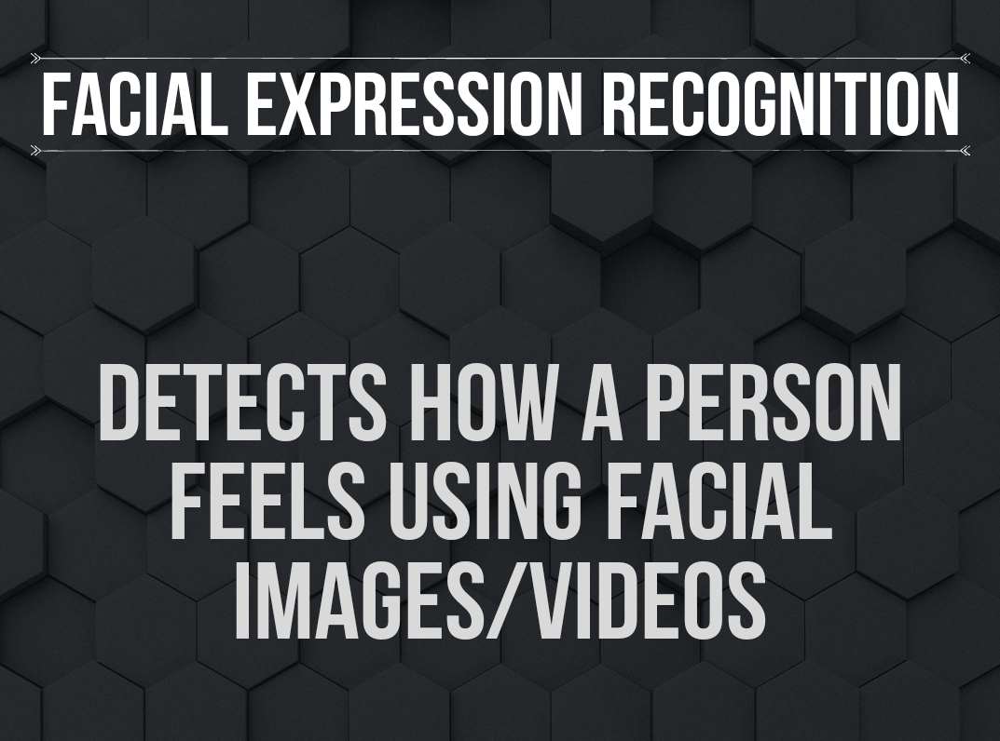

# FaceExpressionEnsemble
Face  Expression Recognition with ensemble for InceptionV3, ResNet50, MobileNetV2

[![Contributors][contributors-shield]][contributors-url] 
[![Forks][forks-shield]][forks-url]
[![Stargazers][stars-shield]][stars-url]
[![Issues][issues-shield]][issues-url]
[![MIT License][license-shield]][license-url]
[![LinkedIn][linkedin-shield]][linkedin-url]


<!-- PROJECT LOGO -->
<br />
<p align="center">
  <a href="https://github.com/Iliescu-Dorin/FaceExpressionEnsemble/">
    
  </a>

  <h2 align="center">Facial Expression Recognition</h>

  <h4 align="center">
  <p align="center">
    Detect human emotions from facial images
    </h4>
  </p>
</p>


<!-- TABLE OF CONTENTS -->
## Table of Contents

- [Table of Contents](#table-of-contents)
- [About The Project](#about-the-project)
  - [Built With](#built-with)
- [Getting Started](#getting-started)
  - [Installation](#installation)
- [Usage](#usage)
- [Product Screenshot](#product-screenshot)
- [Roadmap](#roadmap)
- [Contributing](#contributing)
- [License](#license)
- [Contact](#contact)


<!-- ABOUT THE PROJECT -->
## About The Project


Facial expression recognition aims to detect the persons feeling by using a video stream from the webcam. This detector can detect 7 human emotions which are **Angry**, **Disgust**, **Fear**, **Happy**, **Neutral**, **Sad**, **Surprise** </br>

The model was trained using the [ICML 2013 Facial Expression Recignition dataset](https://www.kaggle.com/c/challenges-in-representation-learning-facial-expression-recognition-challenge)

The training dataset contains: 
* 436 disgust images
* 4097 fear images
* 3171 surprise images
* 4965 neutral images
* 7214 happy images
* 84830 sad images
* 3995 angry images


  I used the following architecture to train the model on [Google Colab](colab.research.google.com) and downloaded the weights.
  <br />
  <br />

    


### Built With

* [Python](https://www.python.org/)
* [TensorFlow](https://www.tensorflow.org/)
* [Keras](keras.io)
* [OpenCV](https://opencv.org/)
* [Flask](https://flask.palletsprojects.com/en/1.1.x/)


<!-- GETTING STARTED -->
## Getting Started

You will need Python (>3.6), TensorFlow2 to run this. <br/>
Installation of required packages is covered under ```installation``` </br>
To get a local copy up and running follow these simple example steps.


### Installation

1. Make sure you have python3 setup on your system
2. Clone the repo
```sh
git clone https://github.com/radioactive11/Facial-Expression-Recognition
```
3. Install requirements
```sh
pip install -r requirements.txt
```
4. Open terminal and enter
```
python3 main.py
```
5. Check port on which Flask Server is running (in this case it is 5000) <br />

 

1. Open any browser and enter URL (replace port with what you get on running ```main.py```)

   ```
   127.0.0.1:<port>
   ```


<!-- USAGE EXAMPLES -->
## Usage

In order to use this app, you must have a working webcam. If you want to run detections on a video, goto camera.py and change (line 11)
```py 
self.video = cv2.VideoCapture(0)
```
to
```py
 self.video = cv2.VideoCapture("path to video.mp4")
```
## Product Screenshot
![product-screenshot]


<!-- ROADMAP -->
## Roadmap

See the [open issues](https://github.com/radioactive11/Facial-Expression-Recognition/issues) for a list of proposed features (and known issues).


<!-- CONTRIBUTING -->
## Contributing

Contributions are what make the open source community such an amazing place to be learn, inspire, and create. Any contributions you make are **greatly appreciated**.

1. Fork the Project
2. Create your Feature Branch (`git checkout -b feature/AmazingFeature`)
3. Commit your Changes (`git commit -m 'Add some AmazingFeature'`)
4. Push to the Branch (`git push origin feature/AmazingFeature`)
5. Open a Pull Request


<!-- LICENSE -->
## License

Distributed under the MIT License. See `LICENSE` for more information.


<!-- CONTACT -->
## Contact

Arijit Roy - [@this_is_radioactive11](https://www.instagram.com/this_is_radioactive11/) <br />
Project Link: [https://github.com/radioactive11/Facial-Expression-Recognition](https://github.com/radioactive11/Facial-Expression-Recognition)


[contributors-shield]: https://img.shields.io/github/contributors/radioactive11/Facial-Expression-Recognition.svg?style=flat-square
[contributors-url]: https://github.com/radioactive11/Facial-Expression-Recognition/graphs/contributors
[forks-shield]: https://img.shields.io/github/forks/radioactive11/Facial-Expression-Recognition.svg?style=flat-square
[forks-url]: https://github.com/radioactive11/Facial-Expression-Recognition/network/members
[stars-shield]: https://img.shields.io/github/stars/radioactive11/Facial-Expression-Recognition.svg?style=flat-square
[stars-url]: https://github.com/radioactive11/Facial-Expression-Recognition/stargazers
[issues-shield]: https://img.shields.io/github/issues/radioactive11/Facial-Expression-Recognition.svg?style=flat-square
[issues-url]: https://github.com/radioactive11/Facial-Expression-Recognition/issues
[license-shield]: https://img.shields.io/github/license/radioactive11/Facial-Expression-Recognition.svg?style=flat-square
[license-url]: https://github.com/radioactive11/Facial-Expression-Recognition/blob/master/LICENSE.txt
[linkedin-shield]: https://img.shields.io/badge/-LinkedIn-black.svg?style=flat-square&logo=linkedin&colorB=555
[linkedin-url]: https://linkedin.com/in/arijit--roy
[product-screenshot]: 1_Moment.jpg
[product-post]: images/post.png

